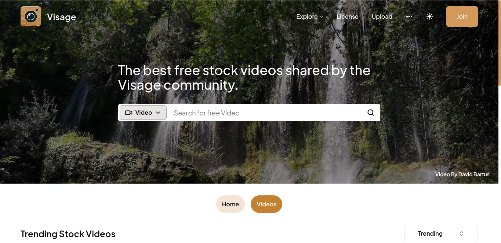

**Visage**: A Pexels Web App Clone
Visage is an innovative web application designed as a clone of the popular Pexels platform, offering a rich repository of high-quality, free stock photos and videos. The project aims to replicate the seamless user experience and comprehensive functionality of Pexels, allowing users to explore, download, and share a vast collection of media content. With a sleek and intuitive interface, Visage enables users to easily search for images and videos using various filters and categories, ensuring they find exactly what they need. The app incorporates advanced features such as user authentication, personalized collections, and the ability to upload and manage media assets. Built with modern web technologies and a robust backend, Visage promises a reliable and efficient performance, making it a valuable resource for designers, marketers, and content creators seeking high-quality visual content for their projects. Whether you are looking for inspiration or specific media for your work, Visage provides a user-friendly and comprehensive solution, capturing the essence of the Pexels experience.

## Technologies Used

- **Next.js**: A React framework for server-side rendering and generating static websites.

- **TypeScript**: A typed superset of JavaScript that adds type safety and enhances development experience.

- **Tailwind CSS**: A utility-first CSS framework for styling the application.

- **ShadcnUI** : Beautifully designed components that you can copy and paste into your apps. Accessible. Customizable

- **NextAuth** : NextAuth.js is a complete open-source authentication solution for Next.js applications.
  It is designed from the ground up to support Next.js and Serverless.

## Currently work on progress

- User authentication via email password
- Video Uploads

## Screenshot

